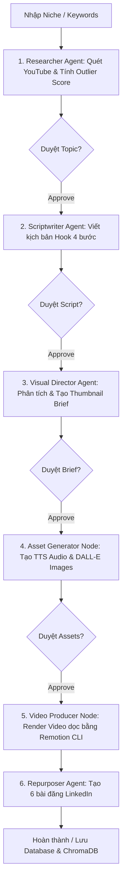

Listed directory AI-content-agentic-system
Listed directory docs
Listed directory knowledge
Viewed project_context.md:1-73
Viewed architecture.md:1-65
Viewed project-new-features-v1.md:1-118
Viewed video-generation-remotion.md:1-53
Viewed techstack.md:1-74
Viewed viral_content_production.md:1-184

Dưới đây là tổng kết toàn diện về kiến trúc, chức năng và quy trình hoạt động hiện tại của sản phẩm **AI-content-agentic-system (Multi-Agent Content Machine v1.0)**:

---

## 🌟 1. Tổng quan về sản phẩm (Product Overview)
Sản phẩm là một hệ thống sản xuất nội dung tự động đa nền tảng hoạt động theo mô hình **Multi-Agent (Đa tác nhân AI)**. Hệ thống chuyển đổi hoàn toàn quy trình làm content từ **"đoán mò" (Guessing)** sang **"dựa trên dữ liệu thực tế" (Data-driven)** bằng cách phân tích các chủ đề đang có động lực phát triển (momentum) trên YouTube, sau đó tự động hóa việc viết kịch bản, thiết kế brief thumbnail, tạo tài nguyên (âm thanh, hình ảnh), render video dọc hoàn chỉnh và tái chế nội dung sang LinkedIn.

**Triết lý cốt lõi**: *"You focus on execution, not guessing."* (Tập trung vào thực thi, loại bỏ sự phỏng đoán). Hệ thống tích hợp chặt chẽ cơ chế **Human-in-the-loop (HITL)**, cho phép con người kiểm duyệt và điều chỉnh ở từng mốc quan trọng trước khi hệ thống chạy bước tiếp theo.

---

## 🏗️ 2. Kiến trúc hệ thống 4 lớp (4-Layer Architecture)

Hệ thống được thiết kế với kiến trúc phân lượng rõ ràng để đảm bảo tính mở rộng và ổn định:

1. **Frontend Layer (Next.js / React + TypeScript)**:
   - Dashboard trực quan cho phép người dùng nhập Niche/Topic/Keywords.
   - Theo dõi trạng thái tiến trình theo thời gian thực qua `task_id`.
   - Giao diện thao tác kiểm duyệt (Approve / Reject / Edit) tại từng mốc kiểm duyệt (checkpoint).

2. **Orchestration Layer (FastAPI + LangGraph)**:
   - Điều phối luồng thực thi (State Machine) của toàn bộ các Agent chuyên trách.
   - Quản lý vòng đời của `task_id` và cơ chế tạm dừng/tiếp tục (resume) qua API.

3. **LLM Layer (LLM Factory)**:
   - Hỗ trợ linh hoạt đa mô hình: **OpenAI, Anthropic** và mô hình mã nguồn mở chạy cục bộ **Ollama**.
   - Tách biệt vai trò rõ ràng của các LLM theo mục đích sử dụng: `reasoning` (suy luận/nghiên cứu), `writing` (viết lách), và `vision` (phân tích hình ảnh).

4. **Memory, Persistence & Video Layer**:
   - **PostgreSQL**: Lưu trữ trạng thái tác vụ (`content_tasks`), lịch sử và dữ liệu đầu ra của từng bước.
   - **ChromaDB (RAG)**: Lưu trữ vector embedding của các kịch bản thành công và cẩm nang thương hiệu (brand guidelines) để tham chiếu dài hạn.
   - **Remotion App**: Engine render video tự động bằng React dựa trên file `manifest.json`.

---

## ⚙️ 3. Chi tiết quy trình sản xuất & Các Agent chuyên trách

Quy trình làm việc (Workflow) được chia thành 6 bước nối tiếp nhau với các Agent chuyên biệt:



### 🔍 Bước 1: Viral Detection (Researcher Agent)
- **Công cụ / Tích hợp**: YouTube Data API v3 (kết nối qua n8n).
- **Chức năng**: Quét tối thiểu 20 video mới trong ngách (niche) được yêu cầu. Thu thập dữ liệu lượt xem video (`video_views`) và trung bình lượt xem của kênh (`channel_average_views`).
- **Phân tích Data-first**: Tính toán chỉ số **Outlier Score** theo công thức:
  $$\text{Outlier Score} = \left(\frac{\text{video\_views}}{\text{channel\_average\_views}}\right) \times 100$$
- **Phân loại**:
  - `Score >= 500`: 🔥 Viral Outlier (Cực kỳ bùng nổ).
  - `Score >= 200`: ⭐ Strong Outlier (Có động lực mạnh mẽ).
  - `Score < 200`: Loại bỏ hoàn toàn (Không đủ điều kiện sản xuất).
- 🛑 **HITL Checkpoint**: Dừng để người dùng chọn/duyệt chủ đề Outlier muốn làm (`awaiting_topic_approval`).

### ✍️ Bước 2: Script Writing (Scriptwriter Agent)
- **LLM chuyên trách**: Claude 3.5 Sonnet / LLM Factory (tối ưu văn phong tự nhiên, tuân thủ Brand Voice).
- **Chức năng**: Phân tích góc tiếp cận (angle) của video gốc và viết kịch bản hoàn chỉnh tuân thủ nghiêm ngặt **Cấu trúc Hook 4 bước**:
  1. **Identify**: Nhận diện vấn đề/nỗi đau của người xem.
  2. **Missed Opportunity**: Chỉ ra cơ hội mà họ đang bỏ lỡ.
  3. **Outcome**: Đưa ra kết quả cụ thể họ sẽ đạt được.
  4. **Visual Preview**: Mô tả hình ảnh/phân cảnh mở đầu để giữ chân người xem.
- 🛑 **HITL Checkpoint**: Dừng để người dùng kiểm tra, chỉnh sửa hoặc duyệt kịch bản (`awaiting_script_approval`).

### 🎨 Bước 3: Thumbnail Briefing (Visual Director Agent)
- **LLM chuyên trách**: GPT-4o Vision (Phân tích thị giác).
- **Chức năng**: Phân tích các thumbnail viral của các video Outlier (bảng màu, biểu cảm, text overlay, bố cục). Từ đó lập ra **Thumbnail Brief** sắc bén cho designer hoặc công cụ AI, chỉ định rõ: Concept, màu sắc đề xuất, text overlay (tối đa 5 từ), cảm xúc và **các yếu tố CẦN TRÁNH** để không sao chép nguyên bản gốc.
- 🛑 **HITL Checkpoint**: Dừng để người dùng duyệt Brief (`awaiting_thumbnail_approval`).

### 🎙️ Bước 4: Asset Generation (Asset Generator Node)
- **Chức năng**: Tự động hóa việc tạo tài nguyên thô cho video. Gọi API OpenAI TTS để tổng hợp giọng nói (Voiceover) cho từng phân cảnh (scene) và DALL-E để tạo hình ảnh minh họa tương ứng.
- **Tổng hợp dữ liệu**: Xuất cấu trúc file `manifest.json` chứa danh sách các phân cảnh (đường dẫn hình ảnh, đường dẫn âm thanh, thời lượng giây tính toán tự động).
- 🛑 **HITL Checkpoint**: Dừng để người dùng nghe thử audio và xem trước hình ảnh của từng phân cảnh (`awaiting_assets_approval`).

### 🎬 Bước 5: Video Production (Video Producer Node & Remotion)
- **Chức năng**: Backend gọi tiến trình phụ (subprocess) thực thi Remotion CLI:
  ```powershell
  npx remotion render WalkthroughVideo public/output_{task_id}.mp4 --props <manifest_path>
  ```
- **Xử lý Video (1080x1920)**: Tự động ghép ảnh theo phân cảnh, khớp đồng bộ với audio voiceover của từng cảnh, chèn nhạc nền (BGM track) xuyên suốt timeline với âm lượng chuẩn, xử lý các khung hình chuyển cảnh (transition frames) và lưu kết quả vào `video_result`.

### 🔄 Bước 6: LinkedIn Repurposing (Repurposer Agent)
- **Chức năng**: Nhận kịch bản gốc và tự động tái chế thành **6 định dạng bài đăng LinkedIn** khác nhau để tối ưu hóa phân phối nội dung:
  1. `Personal Story`: Kể chuyện/trải nghiệm cá nhân.
  2. `Strong Opinion`: Quan điểm mạnh mẽ/gây tranh luận.
  3. `Step-by-step`: Hướng dẫn thực hành từng bước.
  4. `Question Hook`: Mở đầu bằng câu hỏi gợi mở tư duy.
  5. `Data & Insight`: Phân tích dựa trên số liệu/nghiên cứu.
  6. `Failure & Lesson`: Bài học rút ra từ thất bại.

---

## 🛡️ 4. Tính năng quản lý vận hành & Độ tin cậy (Reliability & Operations)

1. **Quản lý trạng thái & HITL Checkpoints**:
   - Hệ thống duy trì các trạng thái vòng đời chi tiết: `generating_assets`, `awaiting_topic_approval`, `awaiting_script_approval`, `awaiting_thumbnail_approval`, `awaiting_assets_approval`, `rendering_video`, `repurposing`, `completed`, `failed`.
   - Cơ chế tiếp tục (Resume) mượt mà thông qua endpoint `/api/approve` và truy vấn tiến trình qua `/api/status/{task_id}`.

2. **Bảo đảm chất lượng đầu ra (Schema Validation)**:
   - Mọi dữ liệu đầu ra của LLM (từ Researcher, Scriptwriter, Visual Director đến Repurposer) đều được kiểm tra chặt chẽ qua lớp Pydantic Schema Validation. Nếu LLM trả về sai cấu trúc, hệ thống sẽ báo lỗi ngay lập tức (Fail-fast).

3. **Cơ chế Fail Gracefully**:
   - Chuẩn hóa toàn bộ payload báo lỗi theo định dạng chung (`code`, `message`, `task_id`, `step`).
   - Nếu một tác nhân hoặc tiến trình render bị lỗi (ví dụ: timeout khi render video), lỗi sẽ được ghi nhận vào PostgreSQL và hiển thị lên UI cho người dùng xử lý, hoàn toàn không làm sập tiến trình của hệ thống.