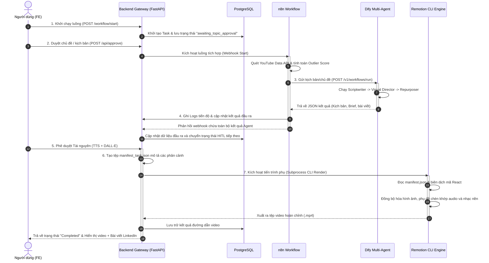

# Bản Đồ Liên Kết và Luồng Dữ Liệu: Dify — n8n — Remotion

Tài liệu này giải thích chi tiết cách thức liên kết, giao tiếp và đồng bộ dữ liệu giữa ba thành phần cốt lõi của hệ thống: **Dify** (Trí tuệ nhân tạo Agent), **n8n** (Tự động hóa tích hợp), và **Remotion** (Dựng video tự động bằng code), dưới sự điều phối của **Backend API Gateway (FastAPI)**.

---

## 1. Sơ đồ kiến trúc luồng dữ liệu (Dataflow Map)

Luồng hoạt động dưới sự điều phối trung tâm của Backend và sự kết hợp của n8n, Dify, cùng Remotion được trực quan hóa qua sơ đồ dưới đây:



---

## 2. Chi tiết cơ chế liên kết giữa các thành phần

### 2.1 Liên kết giữa n8n và Dify (Tích hợp & Trí tuệ nhân tạo)
- **Phương thức liên kết**: HTTP REST API (`blocking mode`).
- **Cách thức hoạt động**: 
  - **n8n** hoạt động như một "kỹ sư tích hợp". Sau khi lấy thông tin nghiên cứu thị trường từ YouTube API, n8n thực hiện một cuộc gọi API `POST` đến Dify Workflow Gateway:
    ```json
    POST http://localhost/v1/workflows/run
    Authorization: Bearer <DIFY_API_TOKEN>
    {
      "inputs": {
        "niche": "AI Automation",
        "selected_title": "Cách tối ưu hóa quy trình làm việc bằng AI",
        "language": "vi",
        "reference_thumbnail_url": "https://img.youtube.com..."
      },
      "response_mode": "blocking",
      "user": "content-machine-n8n"
    }
    ```
  - **Dify** tiếp nhận payload, chạy chuỗi Multi-Agent (Scriptwriter -> Visual Director -> Repurposer) trong môi trường đóng gói của Dify và trả về kết quả JSON có cấu trúc hoàn chỉnh cho n8n.

### 2.2 Liên kết giữa Dify, n8n và Backend Gateway (FastAPI + Postgres)
- **Phương thức liên kết**: HTTP Webhook & SQLAlchemy Repository.
- **Cách thức hoạt động**:
  - Tại mỗi mốc thực thi quan trọng, cả n8n và Dify đều phát đi các yêu cầu ghi log đến FastAPI (`POST http://localhost:8080/api/logs`) để đồng bộ trạng thái hệ thống.
  - Sau khi n8n nhận kết quả kịch bản từ Dify, nó sẽ chuyển tiếp toàn bộ gói tin dữ liệu này về Backend Gateway.
  - Backend ghi nhận dữ liệu vào cơ sở dữ liệu PostgreSQL để hiển thị trạng thái chính xác nhất lên giao diện Frontend của người dùng.

### 2.3 Liên kết giữa Backend và Remotion (Tự động hóa Video)
- **Phương thức liên kết**: Tệp kê khai JSON (`manifest.json`) & CLI Subprocess Execution.
- **Cách thức hoạt động**:
  - Khi người dùng phê duyệt tài nguyên hình ảnh và âm thanh TTS ở bước 4 (`awaiting_assets_approval`), Backend FastAPI sẽ thu thập đường dẫn của tất cả ảnh DALL-E, file đọc âm thanh TTS của từng phân cảnh và ghi ra một file manifest cục bộ:
    ```json
    {
      "audioBgmUrl": "/audio/bgm/chill-vibe.mp3",
      "scenes": [
        {
          "text": "Bạn đang bỏ lỡ hàng ngàn lượt tương tác vì làm nội dung đoán mò...",
          "imageUrl": "/assets/generated/task_123/scene1.png",
          "audioUrl": "/assets/generated/task_123/scene1.mp3",
          "durationInSeconds": 8
        },
        {
          "text": "Đây là giải pháp giúp bạn tự động hóa hoàn toàn quy trình.",
          "imageUrl": "/assets/generated/task_123/scene2.png",
          "audioUrl": "/assets/generated/task_123/scene2.mp3",
          "durationInSeconds": 6
        }
      ]
    }
    ```
  - Tiếp theo, Backend gọi một tiến trình phụ của hệ thống để chạy lệnh render Remotion CLI dưới nền:
    ```powershell
    npx remotion render WalkthroughVideo public/output_task_123.mp4 --props=remotion_app/public/assets/generated/task_123/manifest.json
    ```
  - **Remotion** (chạy bằng React + Node.js) nhận file props này, ánh xạ danh sách phân cảnh vào Component `<WalkthroughComposition />`. Nó tự động tính toán tổng số khung hình (frames) dựa trên thời lượng audio, hiển thị hình ảnh và phụ đề chạy chữ khớp theo từng giây, lồng nhạc nền, chuyển cảnh mượt mà và xuất ra file video dọc `.mp4` hoàn chỉnh tại thư mục public để Frontend có thể phát trực tiếp.
